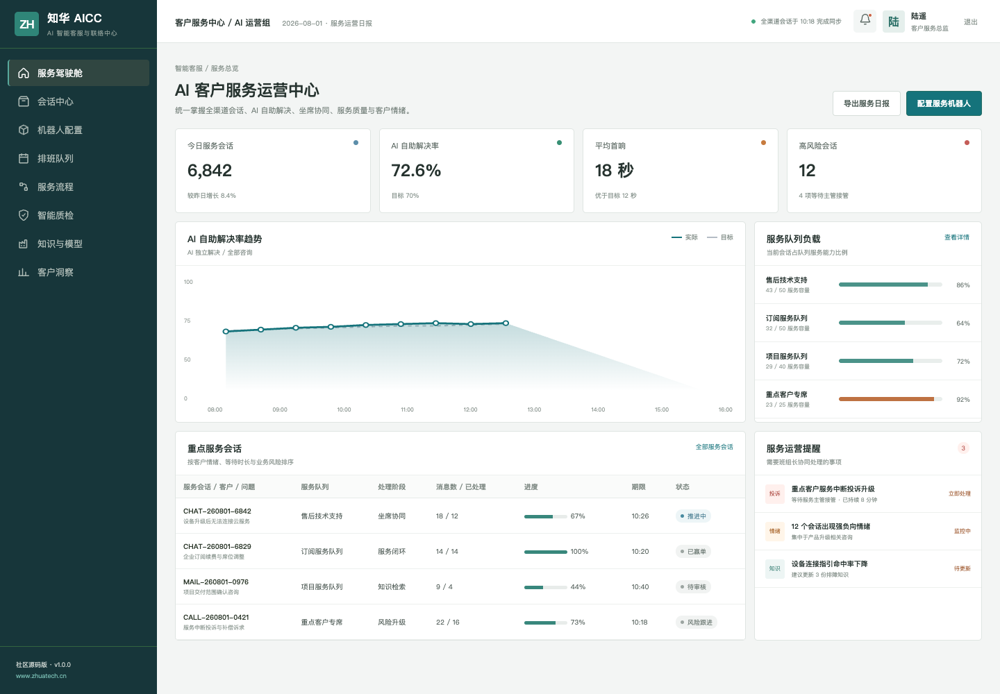
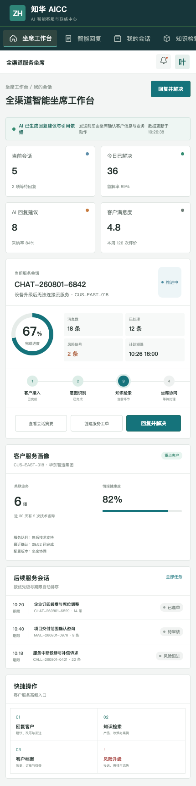

# ZhuaTech AICC｜知华科技 AI 智能客服与联络中心

让 AI 负责理解、检索和建议，让服务人员专注解决真正的客户问题。

知华科技（上海如静知华信息科技有限公司）官网：[https://www.zhuatech.cn/](https://www.zhuatech.cn/)

## 服务运营现场



运营驾驶舱呈现全渠道会话、AI 自助解决率、队列负载、客户情绪、风险会话和智能质检结果，适合客服主管进行实时调度和服务复盘。



坐席端汇聚会话上下文、客户画像、知识引用和 AI 回复建议；涉及退款、补偿、承诺与敏感信息时，必须由人工确认后执行。

## 覆盖的客户服务闭环

1. 网站、H5、电话、邮件和工单渠道接入
2. 意图识别、情绪分析、客户身份与历史上下文
3. 企业知识检索、可信引用和回复建议
4. AI 自助、坐席协同、技能组转接与风险升级
5. 会话摘要、工单生成、服务质检和客户洞察

新增会话智能分级能力：结合投诉/紧急关键词、情绪分值、连续失败次数和业务承诺，输出 P1-P4 优先级、人工接管建议、服务时限、推荐队列及可解释原因。

## 工程结构

- `backend`：Java 21 + Spring Boot API，包含 JWT、JPA、Flyway 和领域服务
- `frontend`：Vue 3 管理端与响应式坐席端
- `deploy`：MySQL 8、Nginx 和 Docker Compose 部署说明
- `docs`：架构、数据库和 API 文档

包名 `cn.zhuatech.aicc`，数据库 `zhuatech_aicc`。第三方大模型、语音和消息渠道均按 Provider 接口对接，仓库中没有真实凭证。

## 快速查看演示

```bash
cd frontend
npm install
npm run dev:demo
```

访问 `http://localhost:5173`。管理端账号 `planner / Demo@2026`，坐席端账号 `operator / Demo@2026`。页面中的客户、会话和业务数据均为虚构。

## 非商业许可

本项目仅限个人学习、研究及非商业技术交流，**不得商用**。企业内部使用、生产部署、商业项目、SaaS、收费培训、咨询实施、品牌替换和再分发均须取得上海如静知华信息科技有限公司书面授权，详见 [LICENSE](LICENSE)。

智能客服、呼叫中心、知识库、CRM 集成和深度定制可访问[知华科技官网](https://www.zhuatech.cn/)或扫码咨询：

| 微信咨询一 | 微信咨询二 |
| --- | --- |
|  |  |

SEO 关键词：AI 智能客服源码、AICC、智能联络中心、客服机器人、智能质检、坐席辅助、Java 客服系统、知华科技。

## 会话质量评估

新增 `POST /api/aicc/insights/conversation-quality`，综合问题解决、升级、情绪变化、合规命中和响应 SLA 生成质量分，输出 `EXCELLENT`、`COACH` 或 `REVIEW` 及质检建议。

## 企业级客服交互结案

新增 `POST /api/enterprise/aicc/interaction-closure`，覆盖身份、同意、必要告知、数据脱敏、投诉、质检和录音留存，返回 `CLOSE / REVIEW / BLOCKED`。详见 [交互结案说明](docs/ENTERPRISE_INTERACTION_CLOSURE.md)。
